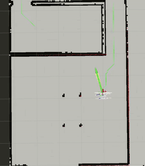

# A-Star-Path-Planning-for-Obstacle-Avoidance-on-TurtleBot3

This repository implements A* path planning for obstacle avoidance on TurtleBot3 using ROS 2. The project enables the TurtleBot3 to autonomously navigate to a specified goal while avoiding obstacles in a simulated environment.

## Requirements

- [ROS 2 (Humble recommended)](https://docs.ros.org/en/humble/Installation.html)
- [TurtleBot3 packages]([https://emanual.robotis.com/docs/en/platform/turtlebot3/quick-start/](https://emanual.robotis.com/docs/en/platform/turtlebot3/simulation/)) installed (`turtlebot3`, `turtlebot3_simulations`)
- [Gazebo simulation environment](https://gazebosim.org/)
- [RViz](https://docs.ros.org/en/rolling/Tutorials/Using-RViz-with-SLAM.html) for visualization

**Note** : I am using Turtlebot3 Waffle
## Installation

1. Clone this repository into your ROS 2 workspace:
   ```bash
   git clone https://github.com/Shashwat1524/A-Star-Path-Planning-for-Obstacle-Avoidance-on-TurtleBot3.git
   ```

2. Build your workspace

   ```bash
     colcon build
   ```
   
3. Source  your workspace
   ```bash
   source install/setup.bash
   ```

## Usage
### Step 1: Launch the TurtleBot3 simulation
Run the following command to launch Gazebo and RViz for the TurtleBot3 simulation:

```bash
ros2 launch turtlebot3_gazebo navigator.launch.py
```

This will open:
Gazebo: Simulated environment with TurtleBot3
RViz: Visualization tool for monitoring the robot's state and paths

### Step 2: Run the A* path planner and navigator node
Execute the following command to start the A* planner and navigator node:

```bash
ros2 run a_star_planner_follower auto_navigator
```

### Step 3: Set the goal pose in RViz
In RViz, use the 2D Pose Estimate tool to set the robot's initial position (if required).
Use the 2D Goal Pose tool to set the target destination for the robot.
The robot will compute the optimal path using the A* algorithm and the TB3 will navigate to the goal while avoiding obstacles.

## Demonstration
### Simulation


### Turtlebot 4 Hardware


